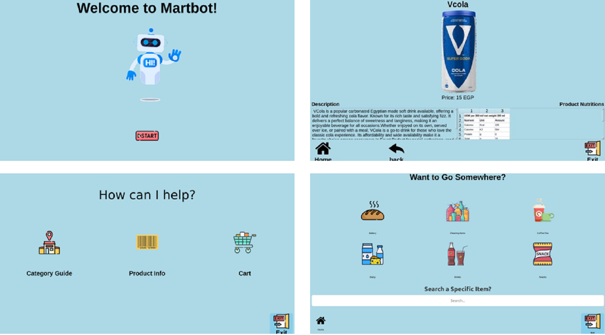
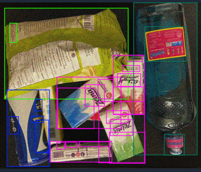
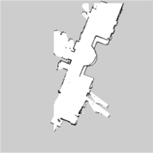
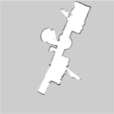
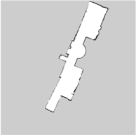
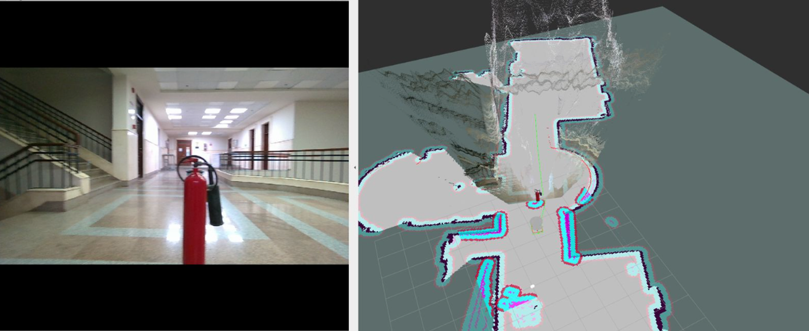
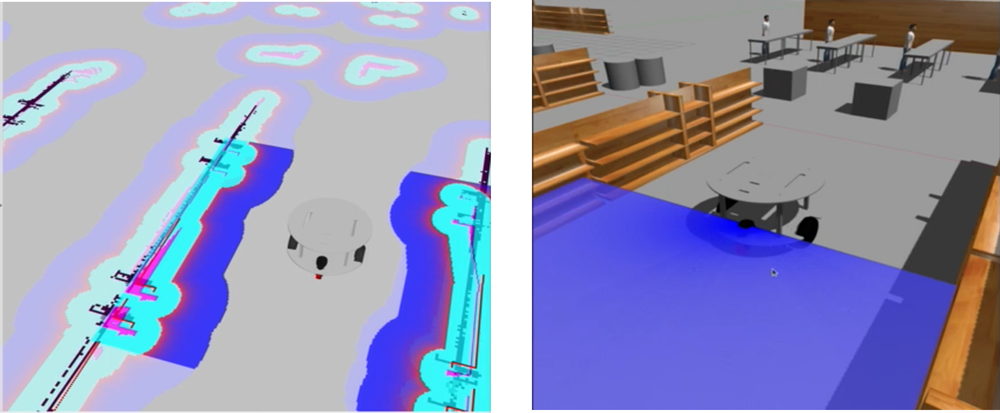

# MartBot - Supermarket Assistant Robot

## Overview

MartBot is an autonomous mobile robot designed specifically to assist elderly and disabled customers in supermarket environments. This graduation project combines advanced robotics, artificial intelligence, and user-centered design to create an accessible shopping companion. The robot provides intelligent navigation guidance through store aisles, delivers comprehensive product information via an intuitive touchscreen interface, and features an AI-powered self-checkout system using computer vision technology. Built on the ROS framework with autonomous navigation and multi-sensor integration, MartBot aims to enhance retail accessibility and promote independent shopping experiences for users with mobility challenges and special needs.

## Design
MartBot features a differential drive configuration optimized for supermarket environments:

- **Functional Form Factor:** Designed to navigate standard supermarket aisles (typically 100–150 cm wide)
- **Integrated Shopping Basket:** Built-in compartment for grocery transportation
- **Touchscreen Interface:** Mounted on the basket for intuitive user interaction, integrated with an onboard camera for product scanning
- **Sensor Mounts:** Dedicated slots for depth camera and LiDAR placement, with an optimized height and field of view

<table>
  <tr>
    <td>
      
    </td>
    <td>
      
    </td>
  </tr>
</table>

<b>MartBot Chassis</b>

<table>
  <tr>
    <td align="center">
      
    </td>
    <td align="center">
      
    </td>
  </tr>
</table>

<b>MartBot CAD Model and Prototype</b>

## Graphical User Interface (GUI)

The graphical user interface (GUI) was developed using **PyQt5** to ensure intuitive and accessible interaction with MartBot. The interface is structured to support users with varying abilities through simplified navigation and large, clearly labeled controls.

The GUI workflow includes the following key components:

- **Landing Interface**: Displays a welcome screen and initiates user interaction.  
- **Service Selection Module**: Allows users to choose assistance categories such as navigation support or item inquiry.  
- **Operational Feedback Panel**: Provides real-time status updates and visual cues during robot movement.  

  <video src="https://github.com/user-attachments/assets/a5d58e8f-a2e6-405e-a680-683db49ca809" controls width="640"></video>
  
<em>Walkthrough of the MartBot touchscreen GUI</em>

  
  
<em>MartBot GUI Layout</em>

> The interface was designed with a focus on accessibility, incorporating high-contrast visuals, large-format buttons, and minimal cognitive load to support elderly and disabled users.

## Self-Checkout System

MartBot integrates an AI-powered computer vision module to enable autonomous perception and decision-making. Built on the **YOLOv5** object detection architecture, the system performs real-time identification and classification of retail products placed in the onboard basket.

Key functionalities include:

- **Product Recognition**: Detects and classifies items using a pretrained YOLOv5 model optimized for supermarket categories.    
- **Checkout Summary Interface**: Displays a live receipt view on the touchscreen for user verification and self-checkout.  

  <video src="https://github.com/user-attachments/assets/1411c6d1-fb4a-47b2-8e5e-298bf569aac2" controls width="640"></video>
  
<em>Demonstration of AI-based real-time product detection and pricing</em>

  
  
<em>YOLOv5 detection output showing product identification with bounding boxes</em>

> The AI system enhances accessibility by eliminating the need for manual scanning and reducing the need to wait in line, streamlining the shopping experience for elderly and disabled users.

## Simultaneous Localization and Mapping (SLAM)

MartBot employs a combination of 2D and 3D SLAM techniques to enable reliable localization and comprehensive environmental mapping in supermarket environments. The SLAM stack was evaluated across traditional and hybrid modalities.

### 2D SLAM Evaluation

To determine the optimal 2D mapping approach, the following algorithms were tested and compared using LiDAR input:

- **GMapping** – Probabilistic grid mapping with particle filters  
- **Cartographer** – Graph-based SLAM with real-time loop closure  
- **Hector SLAM** – Lightweight LiDAR-only solution for fast response  

<table>
  <tr>
    <td align="center">
      
      
<em>Hector SLAM</em>

    </td>
    <td align="center">
      
      
<em>Cartographer</em>

    </td>
    <td align="center">
      
      
<em>GMapping</em>

    </td>
  </tr>
</table>

> GMapping was selected for 2D SLAM deployment due to its balance between stability, accuracy, and computational efficiency.

### RTAB-Map for 3D Mapping

To extend environmental understanding beyond 2D planes, **RTAB-Map** was integrated as a 3D SLAM backend. This hybrid technique with **RGB-D** data (from the RealSense camera) to generate dense 3D maps and perform loop closure with high spatial consistency.

  <video src="https://github.com/user-attachments/assets/4989010d-d4bb-424c-8d45-86a5b5134e3d" controls width="640"></video>
  
<em>3D Mapping demonstration using RTAB-Map with fused LiDAR and depth camera input</em>

> RTAB-Map enhances navigation in complex environments by enabling volumetric awareness, visual loop detection, and robust hybrid localization across multiple sensor modalities.

## Navigation

MartBot’s navigation system is built on ROS and leverages a combination of global planning, local obstacle avoidance, and dynamic voxel-based perception. The architecture supports safe and efficient motion through dynamic environments such as supermarket aisles.

**Core Components:**

- **Global Planner**: Implements A* algorithm for optimal pathfinding on the occupancy map  
- **Local Planner**: Uses Dynamic Window Approach (DWA) for real-time obstacle avoidance  
- **STVL Layer**: A custom Spatio-Temporal Voxel Layer that fuses LiDAR and depth camera data to enhance perception of moving and static obstacles  

---

### STVL + A* Implementation

  
  
<em>STVL costmap and RGB view integration showing dynamic obstacle detection and path planning</em>

---

### STVL Dynamic Obstacle Detection

  <video src="https://github.com/user-attachments/assets/f1bfdc5b-3e0a-4e47-b38e-58fdc8598e22" controls width="640"></video>
  
<em>STVL real-time detection of moving entities using fused LiDAR and depth input</em>

---

### Live Navigation with Human Presence

  <video src="https://github.com/user-attachments/assets/c6f33bfa-7a6a-47ed-bebe-d8de0d0f07bd" controls width="640"></video>
  
<em>MartBot autonomously navigating while safely avoiding a person in its path</em>

> The navigation stack ensures robust and adaptive mobility, maintaining safe distances, rerouting around dynamic elements, and navigating within aisle constraints without reliance on predefined paths.

## Simulation Environment

MartBot was extensively tested in a simulated supermarket environment using **Gazebo** and **RViz** to validate navigation, mapping, and obstacle avoidance prior to real-world deployment.

Key simulation components:

- **2D Costmap Validation**: Demonstrates global and local planner behaviors in a structured retail layout  
- **Gazebo World Model**: Includes shelves, tables, and dynamic obstacles for realistic testing scenarios  

  
  
<em>Simulated navigation in Gazebo and RViz costmap visualization</em>

---

### Simulated Navigation Demo

  <video src="https://github.com/user-attachments/assets/0ae34689-59ab-476a-8855-2929e1a22c1a" controls width="640"></video>
  
<em>MartBot simulation navigating a virtual supermarket environment</em>

> Simulation enabled safe validation of planning and perception modules under controlled, repeatable conditions.

## System Architecture

  
  
<b>Complete System Architecture and Hardware Integration</b>

The system architecture demonstrates MartBot's comprehensive hardware integration across four main layers:

### **User Interface Layer**
- **7-inch Touchscreen**: Primary user interaction interface with HDMI and USB connectivity
- **Status LED Strip**: Visual feedback system for operational status and user guidance

### **Processing Layer**
- **On-board Computer**: Central processing unit managing all robot operations
- **Multiple USB Ports**: Facilitating communication with sensors and peripherals

### **Sensor Layer**
- **RPLiDAR A1**: 360° laser scanning for SLAM and obstacle detection
- **Intel RealSense D455**: RGB-D camera for depth perception and object recognition
- **Adafruit BNO055 Absolute Orientation Sensor**: 9-axis inertial navigation system for orientation tracking
- **Monocular Camera**: Additional visual input for product identification

### **Motor Control & Power Layer**
- **Differential Drive System**: Two BLDC motors with hoverboard controller integration
- **FTDI Communication**: Serial interface for motor control commands
- **Emergency Stop Switch**: Safety mechanism for immediate system shutdown
- **Dual Power System**: 
  - 36V battery for motor operations
  - 12V battery for the on-board computer 
- **Power Management**: Integrated inverter and adapter system with proper grounding

---

## Package Descriptions

| Package | Purpose | Key Components |
|:-------:|:-------:|:--------------:|
| **`martbot_bringup`** | System initialization | Launch files, sensor startup |
| **`martbot_description`** | Robot modeling | URDF files, 3D meshes, joint configs |
| **`martbot_nav`** | Autonomous navigation | Path planning, obstacle avoidance |
| **`martbot_slam`** | Mapping & localization | Gmapping, AMCL, EKF, map files |
| **`martbot_gui_final`** | User interface | Touch-screen GUI, product database |
| **`hoverboard-driver`** | Motor control | Differential drive, speed control |
| **`realsense-ros`** | Depth perception | RGB-D camera, point clouds |
| **`rplidar_ros`** | Environmental scanning | 360° laser, obstacle detection |
| **`yolov5_ros`** | Object recognition | AI-powered product detection |

